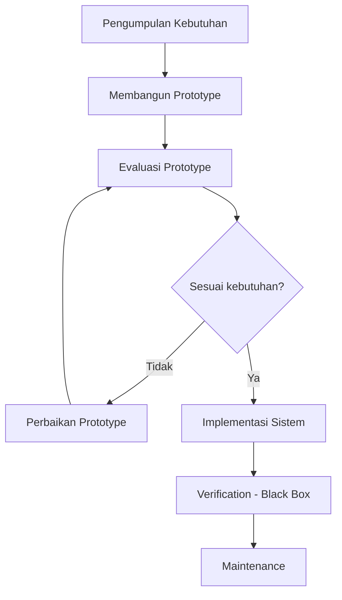

# Bab I–II — Konteks Penelitian

[← Kembali ke README](README.md)

## Identitas Penelitian

| Item | Nilai |
|------|-------|
| Judul | Rancang Bangun Sistem Informasi Inventory Sparepart dan Aksesoris Berbasis Web Pada Toko Android Service Dengan Model Prototyping |
| Peneliti | Aswandi Zamili (NIM 0425720122) |
| Institusi | Program Studi Sistem Informasi, Universitas Nias Raya |
| Tahun | 2026 |
| Lokasi | Toko Android Service Teluk Dalam, Jl. Diponegoro nari-nari, Kec. Teluk Dalam, Kab. Nias Selatan, Sumatera Utara |

## Latar Belakang

Toko Android Service bergerak di bidang perbaikan perangkat Android serta penjualan sparepart dan aksesoris. Pengelolaan inventory saat ini masih manual (buku catatan / file sederhana), sehingga menimbulkan:

- Kesalahan pencatatan data
- Kesulitan monitoring stok secara real-time
- Keterlambatan penyusunan laporan
- Data tidak terintegrasi
- Risiko kehilangan atau kerusakan data

## Tujuan Penelitian

1. Merancang dan membangun sistem informasi inventory sparepart dan aksesoris berbasis web.
2. Menerapkan model pengembangan **prototyping** agar sesuai kebutuhan pengguna.
3. Mempermudah pencatatan barang masuk dan barang keluar secara terkomputerisasi.

## Jenis & Pendekatan

| Aspek | Keterangan |
|-------|------------|
| Jenis | Research and Development (R&D) |
| Pendekatan | Kualitatif |
| Metode pengembangan | Prototyping (iteratif dengan evaluasi pengguna) |
| Pengujian | Black Box Testing |

## Scope Sistem

### In Scope

- Pengelolaan data **sparepart** dan **aksesoris**
- Pencatatan **barang masuk** dan **barang keluar**
- Monitoring **stok persediaan** secara real-time
- Pengelolaan data **supplier**
- Pembuatan **laporan inventory** (stok, barang masuk, barang keluar)
- Manajemen **pengguna** (level `admin` & `karyawan`) dan autentikasi
- Reset password via **email**
- Dashboard ringkasan inventory

### Out of Scope

- Manajemen layanan perbaikan perangkat Android
- Integrasi QR Code (hanya disebut di penelitian relevan, bukan scope proposal ini)
- Deployment ke server production (fokus lingkungan lokal XAMPP)

### Batasan Teknis

| Batasan | Nilai |
|---------|-------|
| Bahasa pemrograman | PHP 8.3+ |
| Framework | CodeIgniter 4.7.3 |
| Database | MySQL 8.4 · `db_inventory_android` |
| Package manager | Composer 2.x |
| Server lokal | XAMPP (Apache 2.4) |
| Model pengembangan | Prototyping |

Detail stack lengkap: [06-implementasi-pengujian.md](06-implementasi-pengujian.md).

## Metode Prototyping

| Tahap | Aktivitas | Output |
|-------|-----------|--------|
| 1. Pengumpulan kebutuhan | Observasi, wawancara, dokumentasi di Toko Android Service | Daftar kebutuhan & masalah |
| 2. Membangun prototype | Desain UI + alur sistem | Mockup / prototype awal |
| 3. Evaluasi prototype | Review oleh admin toko | Masukan & daftar perbaikan |
| 4. Perbaikan prototype | Iterasi berdasarkan masukan | Prototype revisi |
| 5. Implementasi | Coding PHP 8.3 + CI4 + MySQL 8.4 | Aplikasi berjalan |
| 6. Verification | Black box testing | Laporan uji |
| 7. Maintenance | Perbaikan & penyesuaian | Sistem stabil |

### Instrumen Pengumpulan Data

| Instrumen | Fokus |
|-----------|-------|
| Wawancara semi-terstruktur | Proses inventory, kendala, kebutuhan fitur & laporan |
| Observasi | Pencatatan manual, alur barang masuk/keluar, monitoring stok |
| Dokumentasi | Nota penjualan, data stok, laporan, struktur organisasi |

### Kelebihan Metode

- Mempermudah komunikasi pengguna ↔ pengembang
- Mempercepat proses pengembangan
- Mengurangi kesalahan kebutuhan sistem
- Memudahkan evaluasi dan perbaikan iteratif
