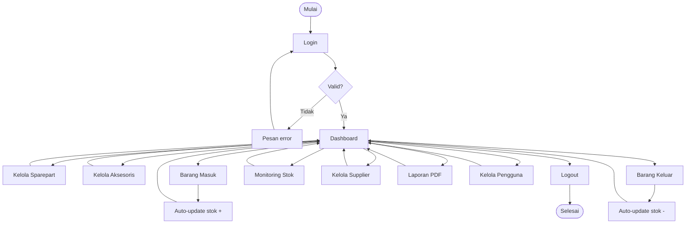
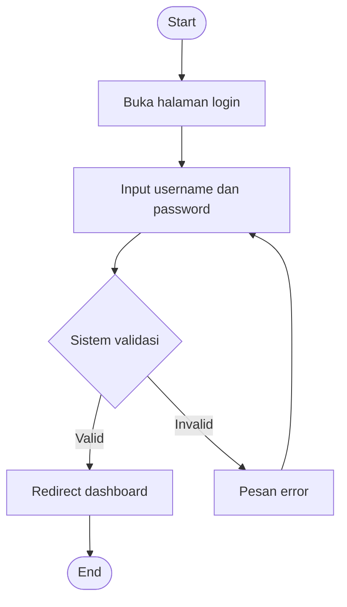
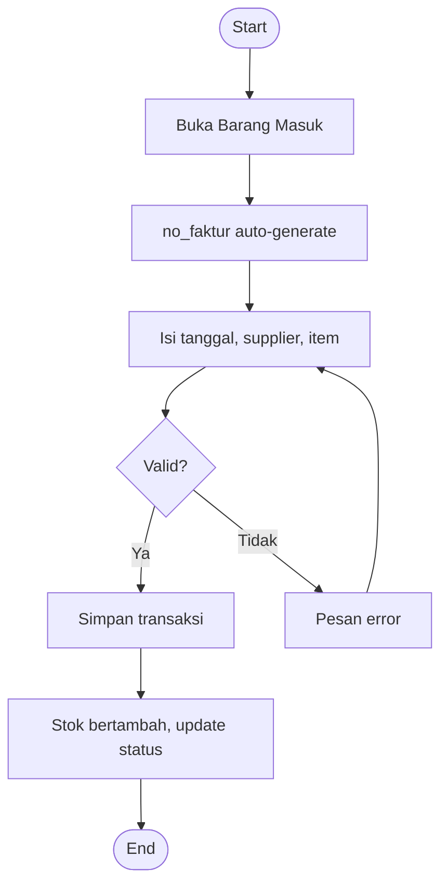
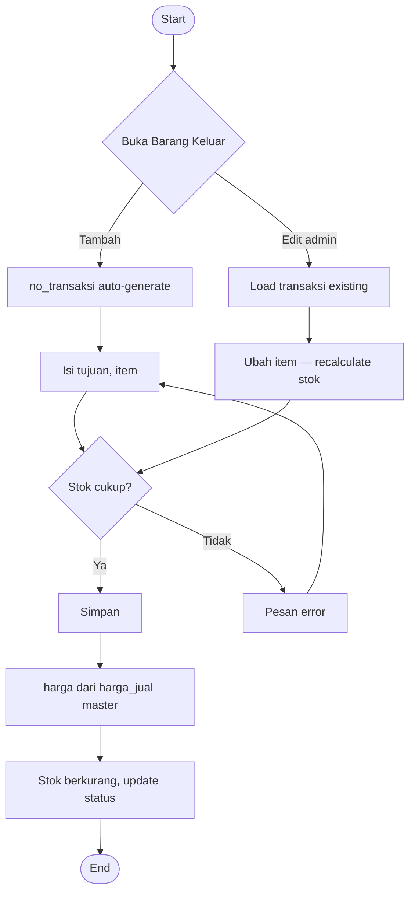

# Bab III — Alur & Antarmuka

[← Kembali ke README](README.md) · [Kebutuhan sistem](02-kebutuhan-sistem.md)

Hak akses per level: matriks tunggal di [02-kebutuhan-sistem.md §1](02-kebutuhan-sistem.md#1-aktor--hak-akses).

---

## 1. Struktur Navigasi

### Sidebar Menu

Urutan menu sesuai mockup proposal (Gambar 3.2):

| No | Menu | Route CI4 | Keterangan |
|----|------|-----------|------------|
| 1 | Dashboard | `/dashboard` | KPI & grafik |
| 2 | Data Sparepart | `/sparepart` | CRUD sparepart |
| 3 | Data Aksesoris | `/aksesoris` | CRUD aksesoris |
| 4 | Barang Masuk | `/barang-masuk` | Transaksi masuk |
| 5 | Barang Keluar | `/barang-keluar` | Transaksi keluar |
| 6 | Stok Barang | `/stok` | Monitoring stok |
| 7 | Supplier | `/supplier` | CRUD supplier |
| 8 | Laporan | `/laporan` | Generate PDF |
| 9 | Pengguna | `/pengguna` | CRUD pengguna (admin only) |
| 10 | Logout | `/logout` | Keluar sistem |

### Layout Umum

Setiap halaman (kecuali login) memiliki:

- **Sidebar** — navigasi menu
- **Header** — tanggal & waktu real-time, info user
- **Content area** — konten modul
- **Footer** — nama sistem & tahun

### Halaman Publik vs Terproteksi

| Halaman | Akses |
|---------|-------|
| Login | Publik |
| Lupa Password / Reset Password | Publik |
| Semua menu lainnya | Session required (`admin` atau `karyawan`) |

Tombol **Hapus** pada transaksi & master data hanya ditampilkan untuk **admin**. Menu **Pengguna** disembunyikan untuk karyawan.

---

## 2. Alur Aktivitas

Berlaku untuk admin dan karyawan (dengan batasan hak akses).

### Diagram Utama

### Login

### Barang Masuk

Tidak dapat diedit setelah disimpan.

### Barang Keluar

### Laporan

1. Pilih jenis (stok / masuk / keluar) + filter periode
2. Query database on-the-fly
3. Render Dompdf → download
