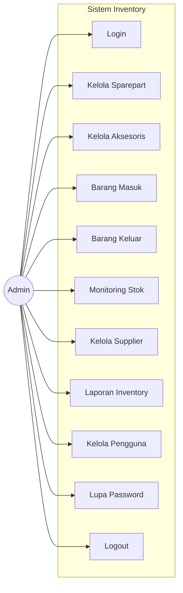
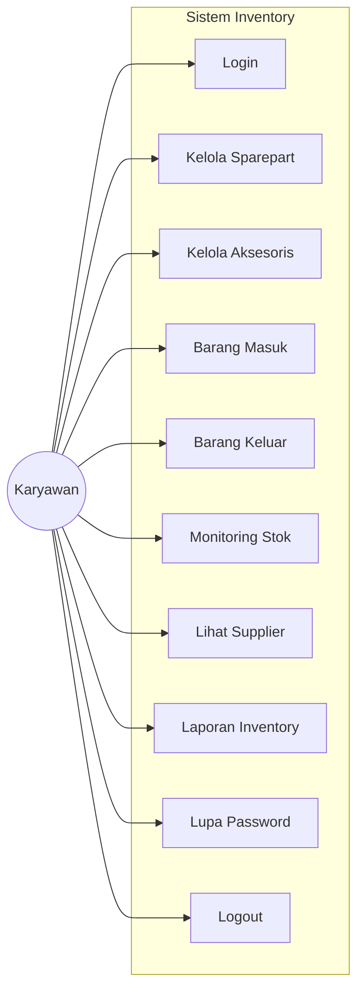
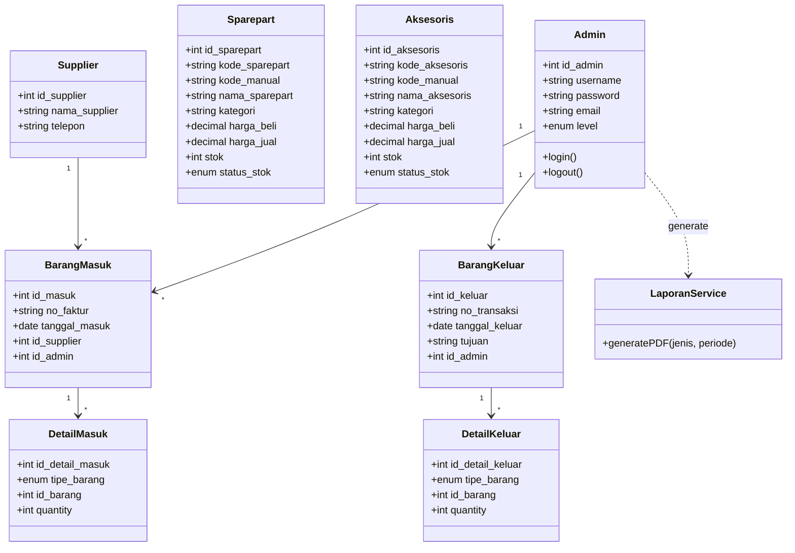
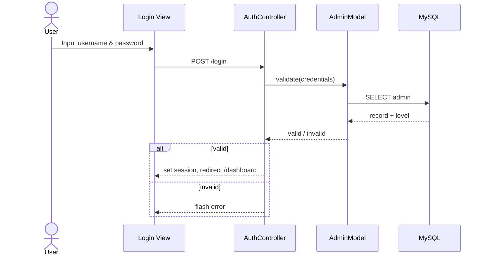
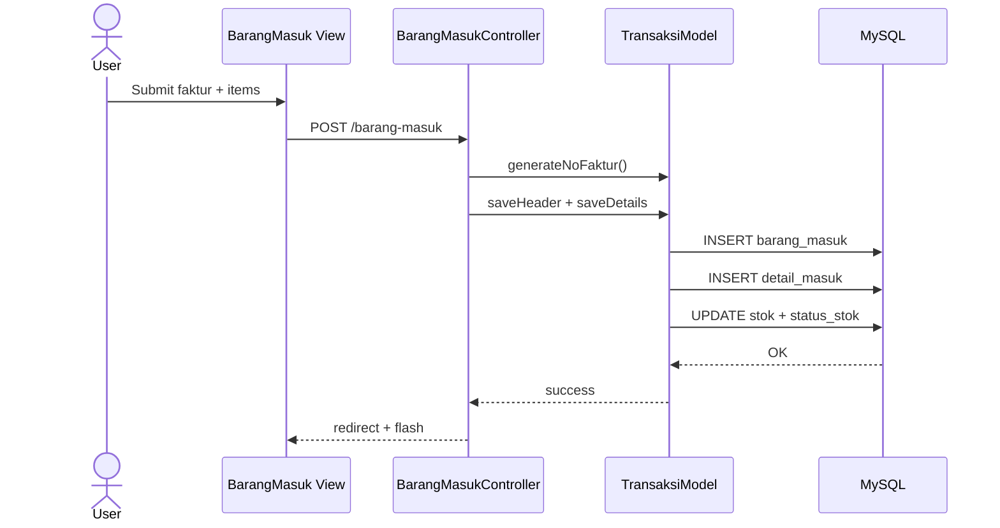
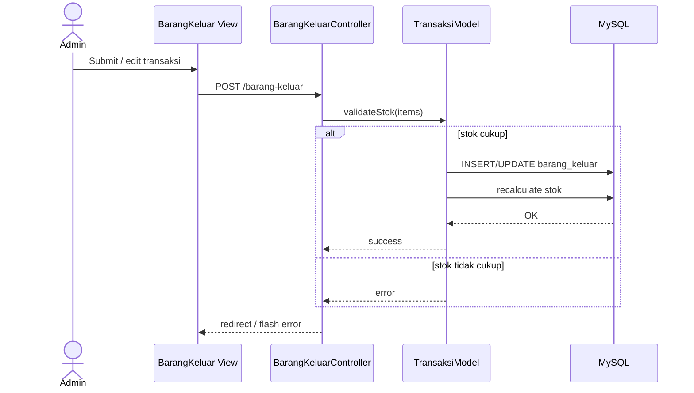
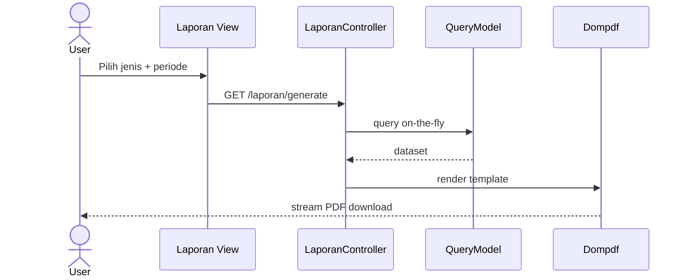

# Bab III — Diagram UML

[← Kembali ke README](README.md)

Deliverable desain untuk skripsi. Activity diagram ada di [03-alur-antarmuka.md](03-alur-antarmuka.md).

---

## 1. Use Case Diagram

### 1.1 Admin

Aktor **Admin** (`admin`) — hak akses penuh termasuk kelola pengguna, hapus data, dan edit transaksi keluar.

| Use Case Admin | Operasi |
|----------------|---------|
| Kelola Sparepart | Lihat, tambah, edit, hapus¹ |
| Kelola Aksesoris | Lihat, tambah, edit, hapus¹ |
| Barang Masuk | Tambah, lihat, cetak, **hapus** |
| Barang Keluar | Tambah, **edit**, lihat, cetak, **hapus** |
| Kelola Supplier | Lihat, tambah, edit, hapus |
| Kelola Pengguna | Lihat, tambah, edit, hapus |

¹ Hapus barang ditolak jika sudah ada riwayat transaksi.

### 1.2 Karyawan

Aktor **Karyawan** (`karyawan`) — operasional harian tanpa kelola pengguna, hapus transaksi, dan edit transaksi keluar.

| Use Case Karyawan | Operasi |
|-------------------|---------|
| Kelola Sparepart | Lihat, tambah, edit |
| Kelola Aksesoris | Lihat, tambah, edit |
| Barang Masuk | Tambah, lihat, cetak |
| Barang Keluar | Tambah, lihat, cetak |
| Lihat Supplier | Referensi saat input barang masuk |

| ID | Use Case | Admin | Karyawan |
|----|----------|:-----:|:--------:|
| UC01 | Login | ✓ | ✓ |
| UC02 | Kelola Sparepart | CRUD penuh | Lihat, tambah, edit |
| UC03 | Kelola Aksesoris | CRUD penuh | Lihat, tambah, edit |
| UC04 | Barang Masuk | + hapus | Tambah, lihat, cetak |
| UC05 | Barang Keluar | + hapus, edit | Tambah, lihat, cetak |
| UC06 | Monitoring Stok | ✓ | ✓ |
| UC07 | Kelola Supplier | CRUD | Lihat saja |
| UC08 | Laporan Inventory | ✓ | ✓ |
| UC09 | Kelola Pengguna | ✓ | ✗ |
| UC10 | Lupa Password | ✓ | ✓ |
| UC11 | Logout | ✓ | ✓ |

| Relasi | Keterangan |
|--------|------------|
| Login `<<include>>` semua UC | Session aktif diperlukan |
| Barang Masuk/Keluar `<<extend>>` Update Stok | Stok diperbarui saat **simpan**, bukan saat hapus |
| Lupa Password `<<include>>` Kirim Email | Token reset dikirim ke email terdaftar |

---

## 2. Class Diagram

| Catatan | Keterangan |
|---------|------------|
| LaporanService | On-the-fly PDF, bukan entitas DB |
| DetailMasuk/Keluar | Polymorphic via `tipe_barang` + `id_barang` |

---

## 3. Sequence Diagram

Status: **draft** — dilengkapi saat implementasi.

### Login

### Barang Masuk

### Barang Keluar

### Generate Laporan PDF

