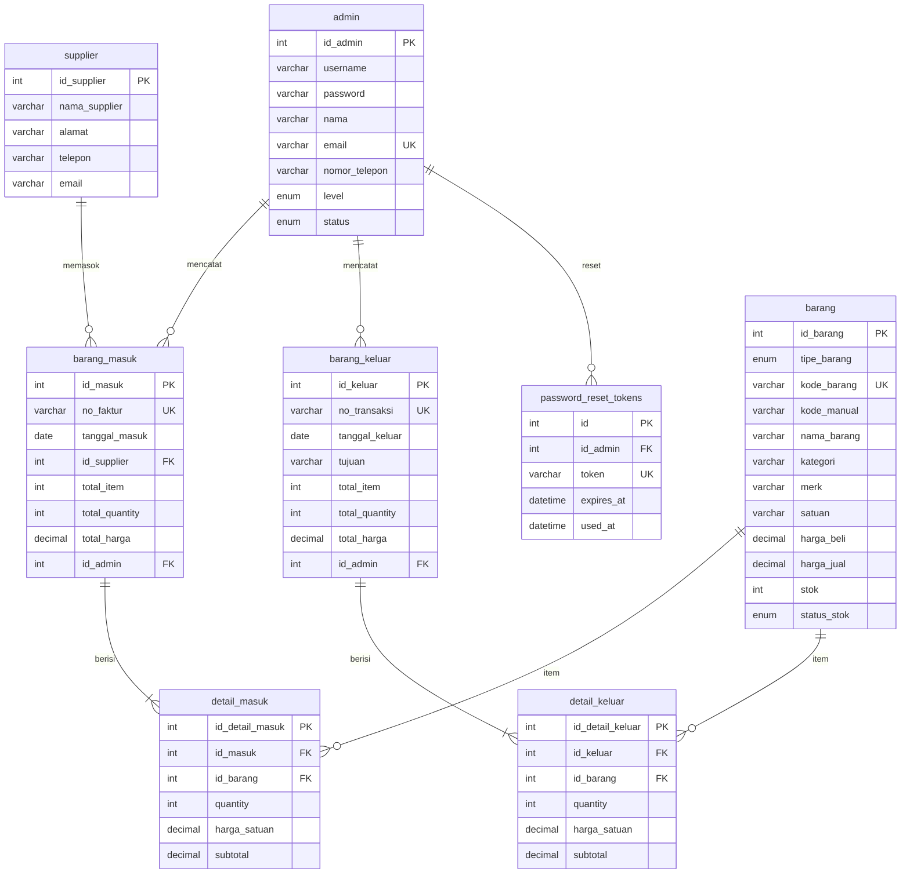

# Bab III — Desain Database

[← Kembali ke README](README.md) · [Aturan bisnis](02-kebutuhan-sistem.md#2-aturan-bisnis)

Database: **`inventory_android`** · MySQL 8.4 · Migration CI4 (`php spark migrate`).

---

## 1. Entity Relationship Diagram

### Entitas

Kelas logis proposal: **Admin**, **Sparepart**, **Aksesoris**, **Barang Masuk**, **Barang Keluar**, **Laporan** (service/controller, bukan tabel).

**Implementasi fisik:** Sparepart & Aksesoris digabung ke tabel **`barang`** (`tipe_barang` ENUM). UI tetap menu terpisah.

Entitas tambahan: `supplier`, `detail_masuk`, `detail_keluar`, `password_reset_tokens`.



### Relasi Kunci

| Relasi                       | Kardinalitas | Keterangan                                                       |
| ---------------------------- | ------------ | ---------------------------------------------------------------- |
| admin → barang_masuk/keluar  | 1:N          | Satu admin mencatat banyak transaksi                             |
| supplier → barang_masuk      | 1:N          | Satu supplier memasok banyak transaksi                           |
| barang_masuk/keluar → detail | 1:N          | Satu transaksi berisi banyak item                                |
| barang → detail              | 1:N          | FK `id_barang` (sparepart/aksesoris via `tipe_barang` di master) |

### Aturan Stok Otomatis

| Event                  | Aksi                                             |
| ---------------------- | ------------------------------------------------ |
| Barang masuk disimpan  | `stok` bertambah sesuai `quantity`               |
| Barang keluar disimpan | `stok` berkurang; validasi tidak negatif         |
| Stok berubah           | `status_stok`: habis (0), rendah (<3), aman (≥3) |
| Transaksi dihapus      | Stok **dikembalikan** (rollback efek simpan)     |

---

## 2. Skema Tabel

### `admin`

| Kolom         | Tipe                     | Constraint                   | Keterangan     |
| ------------- | ------------------------ | ---------------------------- | -------------- |
| id_admin      | INT                      | PK, AUTO_INCREMENT           | —              |
| username      | VARCHAR(50)              | UNIQUE, NOT NULL             | Login          |
| password      | VARCHAR(255)             | NOT NULL                     | Hash (bcrypt)  |
| nama          | VARCHAR(100)             | NOT NULL                     | —              |
| email         | VARCHAR(100)             | UNIQUE, NOT NULL             | Reset password |
| nomor_telepon | VARCHAR(20)              | NULL                         | —              |
| level         | ENUM('admin','karyawan') | NOT NULL, DEFAULT 'karyawan' | —              |
| status        | ENUM('aktif','nonaktif') | DEFAULT 'aktif'              | —              |
| created_at    | DATETIME                 | DEFAULT CURRENT_TIMESTAMP    | —              |
| updated_at    | DATETIME                 | ON UPDATE CURRENT_TIMESTAMP  | —              |

### `barang` (sparepart + aksesoris)

Tabel unifikasi. `tipe_barang`: `sparepart` | `aksesoris`. Kode: `SP-YYYY-NNNN` / `AK-YYYY-NNNN` di kolom `kode_barang` (UNIQUE). Kolom: `kode_manual`, `nama_barang`, `kategori`, `merk`, `satuan`, `harga_beli`, `harga_jual`, `stok`, `status_stok`, timestamps, soft-delete.

### `supplier`

| Kolom                  | Tipe         | Constraint         |
| ---------------------- | ------------ | ------------------ |
| id_supplier            | INT          | PK, AUTO_INCREMENT |
| nama_supplier          | VARCHAR(100) | NOT NULL           |
| alamat                 | TEXT         | NULL               |
| telepon                | VARCHAR(20)  | NULL               |
| email                  | VARCHAR(100) | NULL               |
| created_at, updated_at | DATETIME     | —                  |

### `barang_masuk`

| Kolom                      | Tipe          | Constraint                | Keterangan   |
| -------------------------- | ------------- | ------------------------- | ------------ |
| id_masuk                   | INT           | PK                        | —            |
| no_faktur                  | VARCHAR(30)   | UNIQUE, NOT NULL          | FM-YYYY-NNNN |
| tanggal_masuk              | DATE          | NOT NULL                  | —            |
| id_supplier                | INT           | FK → supplier             | —            |
| total_item, total_quantity | INT           | DEFAULT 0                 | —            |
| total_harga                | DECIMAL(14,2) | DEFAULT 0                 | —            |
| id_admin                   | INT           | FK → admin                | Pencatat     |
| created_at                 | DATETIME      | DEFAULT CURRENT_TIMESTAMP | —            |

### `detail_masuk` / `detail_keluar`

| Kolom                | Tipe          | Constraint                        |
| -------------------- | ------------- | --------------------------------- |
| id_detail_*          | INT           | PK                                |
| id_masuk / id_keluar | INT           | FK, ON DELETE CASCADE             |
| id_barang            | INT           | FK → `barang.id_barang`, RESTRICT |
| quantity             | INT           | NOT NULL, CHECK > 0               |
| harga_satuan         | DECIMAL(12,2) | NOT NULL                          |
| subtotal             | DECIMAL(14,2) | NOT NULL                          |

### `barang_keluar`

| Kolom                      | Tipe          | Constraint                | Keterangan   |
| -------------------------- | ------------- | ------------------------- | ------------ |
| id_keluar                  | INT           | PK                        | —            |
| no_transaksi               | VARCHAR(30)   | UNIQUE, NOT NULL          | TK-YYYY-NNNN |
| tanggal_keluar             | DATE          | NOT NULL                  | —            |
| tujuan                     | VARCHAR(100)  | NOT NULL                  | —            |
| total_item, total_quantity | INT           | DEFAULT 0                 | —            |
| total_harga                | DECIMAL(14,2) | DEFAULT 0                 | —            |
| id_admin                   | INT           | FK → admin                | —            |
| created_at                 | DATETIME      | DEFAULT CURRENT_TIMESTAMP | —            |

### `password_reset_tokens`

| Kolom      | Tipe        | Constraint                |
| ---------- | ----------- | ------------------------- |
| id         | INT         | PK                        |
| id_admin   | INT         | FK, ON DELETE CASCADE     |
| token      | VARCHAR(64) | UNIQUE, NOT NULL          |
| expires_at | DATETIME    | NOT NULL (+60 menit)      |
| used_at    | DATETIME    | NULL                      |
| created_at | DATETIME    | DEFAULT CURRENT_TIMESTAMP |

### Index Rekomendasi

```sql
CREATE INDEX idx_sparepart_kategori ON sparepart(kategori);
CREATE INDEX idx_barang_tipe ON barang(tipe_barang);
CREATE INDEX idx_barang_tipe_status ON barang(tipe_barang, status_stok);
CREATE INDEX idx_barang_kategori ON barang(kategori);
CREATE INDEX idx_barang_masuk_tanggal ON barang_masuk(tanggal_masuk);
CREATE INDEX idx_barang_keluar_tanggal ON barang_keluar(tanggal_keluar);
CREATE INDEX idx_detail_masuk_barang ON detail_masuk(id_barang);
CREATE INDEX idx_detail_keluar_barang ON detail_keluar(id_barang);
```

---

## 3. Seed Data

> Password seed hanya untuk development/demo. Wajib diganti setelah deploy.

Password default semua akun: **`Aswan@2026`**

| Nama           | Level      | Username | Email                        |
| -------------- | ---------- | -------- | ---------------------------- |
| Perubahan Loi  | `admin`    | `admin`  | `admin@androidservice.local` |
| Capan Zalogo   | `karyawan` | `capan`  | `capan@androidservice.local` |
| Rizky Sarumaha | `karyawan` | `rizky`  | `rizky@androidservice.local` |

### Supplier

| Nama                       | Alamat                          | Telepon        |
| -------------------------- | ------------------------------- | -------------- |
| PT Sparepart Mobile Medan  | Jl. Gatot Subroto No. 12, Medan | 0812-4400-0001 |
| Distributor Aksesoris Nias | Jl. Diponegoro, Teluk Dalam     | 0813-5500-0002 |

### Barang (contoh sparepart / aksesoris)

| tipe_barang | kode_barang  | kode_manual  | nama_barang     | kategori | stok | status_stok |
| ----------- | ------------ | ------------ | --------------- | -------- | ---- | ----------- |
| sparepart   | SP-2026-0001 | LCD-A3S-OPPO | LCD Oppo A3S    | LCD      | 10   | aman        |
| sparepart   | SP-2026-0005 | —            | Kamera Belakang | Kamera   | 2    | rendah      |
| aksesoris   | AK-2026-0001 | —            | Charger Type-C  | Charger  | 20   | aman        |
| aksesoris   | AK-2026-0005 | —            | Kabel Data USB  | Kabel    | 1    | rendah      |

### Urutan Seed

```bash
php spark db:seed AdminSeeder
# Seeder master/transaksi tambahan (opsional) menyusul
```
