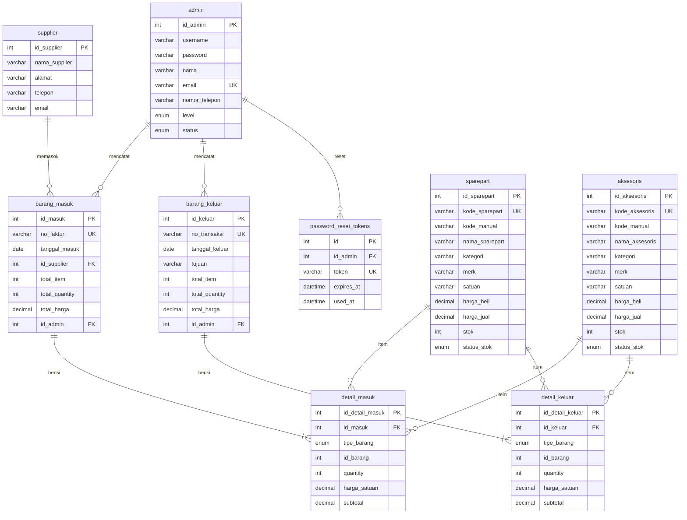

# Bab III — Desain Database

[← Kembali ke README](README.md) · [Aturan bisnis](02-kebutuhan-sistem.md#2-aturan-bisnis)

Database: **`db_inventory_android`** · MySQL 8.4 · Migration CI4 (`php spark migrate`).

---

## 1. Entity Relationship Diagram

### Entitas

Enam kelas inti proposal: **Admin**, **Sparepart**, **Aksesoris**, **Barang Masuk**, **Barang Keluar**, **Laporan** (sebagai LaporanService, bukan tabel).

Entitas tambahan: `supplier`, `detail_masuk`, `detail_keluar`, `password_reset_tokens`.



### Relasi Kunci

| Relasi | Kardinalitas | Keterangan |
|--------|--------------|------------|
| admin → barang_masuk/keluar | 1:N | Satu admin mencatat banyak transaksi |
| supplier → barang_masuk | 1:N | Satu supplier memasok banyak transaksi |
| barang_masuk/keluar → detail | 1:N | Satu transaksi berisi banyak item |
| sparepart/aksesoris → detail | N:M | Via `tipe_barang` + `id_barang` (polymorphic) |

### Aturan Stok Otomatis

| Event | Aksi |
|-------|------|
| Barang masuk disimpan | `stok` bertambah sesuai `quantity` |
| Barang keluar disimpan | `stok` berkurang; validasi tidak negatif |
| Stok berubah | `status_stok`: habis (0), rendah (<3), aman (≥3) |
| Transaksi dihapus | Stok **tidak** diubah |

---

## 2. Skema Tabel

### `admin`

| Kolom | Tipe | Constraint | Keterangan |
|-------|------|------------|------------|
| id_admin | INT | PK, AUTO_INCREMENT | — |
| username | VARCHAR(50) | UNIQUE, NOT NULL | Login |
| password | VARCHAR(255) | NOT NULL | Hash (bcrypt) |
| nama | VARCHAR(100) | NOT NULL | — |
| email | VARCHAR(100) | UNIQUE, NOT NULL | Reset password |
| nomor_telepon | VARCHAR(20) | NULL | — |
| level | ENUM('admin','karyawan') | NOT NULL, DEFAULT 'karyawan' | — |
| status | ENUM('aktif','nonaktif') | DEFAULT 'aktif' | — |
| created_at | DATETIME | DEFAULT CURRENT_TIMESTAMP | — |
| updated_at | DATETIME | ON UPDATE CURRENT_TIMESTAMP | — |

### `sparepart` / `aksesoris`

Struktur identik. Kode: `SP-YYYY-NNNN` / `AK-YYYY-NNNN`. Kolom: `kode_*`, `kode_manual`, `nama_*`, `kategori`, `merk`, `satuan`, `harga_beli`, `harga_jual`, `stok`, `status_stok`, timestamps.

### `supplier`

| Kolom | Tipe | Constraint |
|-------|------|------------|
| id_supplier | INT | PK, AUTO_INCREMENT |
| nama_supplier | VARCHAR(100) | NOT NULL |
| alamat | TEXT | NULL |
| telepon | VARCHAR(20) | NULL |
| email | VARCHAR(100) | NULL |
| created_at, updated_at | DATETIME | — |

### `barang_masuk`

| Kolom | Tipe | Constraint | Keterangan |
|-------|------|------------|------------|
| id_masuk | INT | PK | — |
| no_faktur | VARCHAR(30) | UNIQUE, NOT NULL | FM-YYYY-NNNN |
| tanggal_masuk | DATE | NOT NULL | — |
| id_supplier | INT | FK → supplier | — |
| total_item, total_quantity | INT | DEFAULT 0 | — |
| total_harga | DECIMAL(14,2) | DEFAULT 0 | — |
| id_admin | INT | FK → admin | Pencatat |
| created_at | DATETIME | DEFAULT CURRENT_TIMESTAMP | — |

### `detail_masuk` / `detail_keluar`

| Kolom | Tipe | Constraint |
|-------|------|------------|
| id_detail_* | INT | PK |
| id_masuk / id_keluar | INT | FK, ON DELETE CASCADE |
| tipe_barang | ENUM('sparepart','aksesoris') | NOT NULL |
| id_barang | INT | NOT NULL (polymorphic) |
| quantity | INT | NOT NULL, CHECK > 0 |
| harga_satuan | DECIMAL(12,2) | NOT NULL |
| subtotal | DECIMAL(14,2) | NOT NULL |

### `barang_keluar`

| Kolom | Tipe | Constraint | Keterangan |
|-------|------|------------|------------|
| id_keluar | INT | PK | — |
| no_transaksi | VARCHAR(30) | UNIQUE, NOT NULL | TK-YYYY-NNNN |
| tanggal_keluar | DATE | NOT NULL | — |
| tujuan | VARCHAR(100) | NOT NULL | — |
| total_item, total_quantity | INT | DEFAULT 0 | — |
| total_harga | DECIMAL(14,2) | DEFAULT 0 | — |
| id_admin | INT | FK → admin | — |
| created_at | DATETIME | DEFAULT CURRENT_TIMESTAMP | — |

### `password_reset_tokens`

| Kolom | Tipe | Constraint |
|-------|------|------------|
| id | INT | PK |
| id_admin | INT | FK, ON DELETE CASCADE |
| token | VARCHAR(64) | UNIQUE, NOT NULL |
| expires_at | DATETIME | NOT NULL (+60 menit) |
| used_at | DATETIME | NULL |
| created_at | DATETIME | DEFAULT CURRENT_TIMESTAMP |

### Index Rekomendasi

```sql
CREATE INDEX idx_sparepart_kategori ON sparepart(kategori);
CREATE INDEX idx_sparepart_status ON sparepart(status_stok);
CREATE INDEX idx_aksesoris_kategori ON aksesoris(kategori);
CREATE INDEX idx_barang_masuk_tanggal ON barang_masuk(tanggal_masuk);
CREATE INDEX idx_barang_keluar_tanggal ON barang_keluar(tanggal_keluar);
CREATE INDEX idx_detail_masuk_barang ON detail_masuk(tipe_barang, id_barang);
CREATE INDEX idx_detail_keluar_barang ON detail_keluar(tipe_barang, id_barang);
```

---

## 3. Seed Data

> Password seed hanya untuk development/demo. Wajib diganti setelah deploy.

Password default semua akun: **`Aswan@2026`**

| Nama | Level | Username | Email |
|------|-------|----------|-------|
| Perubahan Loi | `admin` | `admin` | `admin@androidservice.local` |
| Capan Zalogo | `karyawan` | `capan` | `capan@androidservice.local` |
| Rizky Sarumaha | `karyawan` | `rizky` | `rizky@androidservice.local` |

### Supplier

| Nama | Alamat | Telepon |
|------|--------|---------|
| PT Sparepart Mobile Medan | Jl. Gatot Subroto No. 12, Medan | 0812-4400-0001 |
| Distributor Aksesoris Nias | Jl. Diponegoro, Teluk Dalam | 0813-5500-0002 |

### Sparepart

| kode_sparepart | kode_manual | nama_sparepart | kategori | merk | harga_beli | harga_jual | stok | status_stok |
|----------------|-------------|----------------|----------|------|------------|------------|------|-------------|
| SP-2026-0001 | LCD-A3S-OPPO | LCD Oppo A3S | LCD | Oppo | 150000 | 250000 | 10 | aman |
| SP-2026-0002 | BAT-Y12-VIVO | Baterai Vivo Y12 | Baterai | Vivo | 80000 | 130000 | 15 | aman |
| SP-2026-0003 | — | Touchscreen Redmi 9 | Touchscreen | Xiaomi | 120000 | 200000 | 8 | aman |
| SP-2026-0004 | — | IC Charger Samsung | IC | Samsung | 25000 | 45000 | 12 | aman |
| SP-2026-0005 | — | Kamera Belakang | Kamera | Universal | 90000 | 150000 | 2 | rendah |

### Aksesoris

| kode_aksesoris | kode_manual | nama_aksesoris | kategori | merk | harga_beli | harga_jual | stok | status_stok |
|----------------|-------------|----------------|----------|------|------------|------------|------|-------------|
| AK-2026-0001 | — | Charger Type-C | Charger | Generic | 15000 | 35000 | 20 | aman |
| AK-2026-0002 | — | Headset Bluetooth | Audio | Generic | 45000 | 85000 | 15 | aman |
| AK-2026-0003 | — | Tempered Glass | Pelindung Layar | Generic | 5000 | 15000 | 30 | aman |
| AK-2026-0004 | — | Softcase Samsung | Case | Samsung | 10000 | 25000 | 25 | aman |
| AK-2026-0005 | — | Kabel Data USB | Kabel | Generic | 8000 | 20000 | 1 | rendah |

### Urutan Seed

```bash
php spark db:seed AdminSeeder
php spark db:seed SupplierSeeder
php spark db:seed SparepartSeeder
php spark db:seed AksesorisSeeder
```
