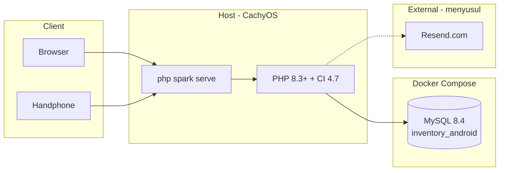
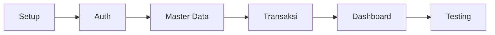

# Bab III–IV — Implementasi & Pengujian

[← Kembali ke README](README.md)

---

## 1. Stack Teknologi

> Proposal menyebut CodeIgniter secara umum. Implementasi menggunakan versi terbaru (Juni 2026).
> Lingkungan dev: **hybrid** — PHP di host, MySQL di Docker (setara peran XAMPP tanpa instal XAMPP).

| Komponen             | Versi        | Catatan                                             |
| -------------------- | ------------ | --------------------------------------------------- |
| **PHP**              | 8.3+         | Host (CachyOS); minimum 8.2 (syarat CI4)            |
| **CodeIgniter**      | 4.7.3        | Framework MVC utama                                 |
| **MySQL**            | 8.4 LTS      | Docker Compose · `inventory_android`                |
| **Composer**         | 2.x          | Dependency management (host)                        |
| **Web server (dev)** | PHP built-in | `php spark serve` — pengganti Apache di development |
| **Dompdf**           | Terbaru      | PDF laporan & transaksi                             |
| **Resend**           | —            | Email reset password — **API key menyusul**         |
| **Bootstrap**        | 5.3          | UI framework                                        |
| **Chart.js**         | 4.x          | Grafik dashboard                                    |

### Ekstensi PHP Wajib

`intl`, `mbstring`, `mysqli` / `pdo_mysql`, `curl`, `gd`, `zip`

### Arsitektur Sistem (Development)



### Lingkungan & Perintah

```bash
# 1. Database
docker compose up -d

# 2. App (setelah scaffold CI4)
composer install
php spark migrate
php spark serve --port 8080
# → http://localhost:8080
```

DB client: CLI `mysql`, DBeaver, TablePlus, dll. (phpMyAdmin tidak dipakai).

### Pola Aplikasi (CI4)

| Aspek    | Implementasi                                      |
| -------- | ------------------------------------------------- |
| Pola     | MVC — Model, View, Controller                     |
| Auth     | Session + Filter (`AuthFilter`, `RoleFilter`)     |
| Email    | CI4 Email → Resend SMTP (**belum dikonfigurasi**) |
| PDF      | Dompdf                                            |
| Database | Migration + Model · host `127.0.0.1:3306`         |
| CLI      | `php spark` (migrate, serve, seed)                |

### Database & Email — Template `.env`

Lihat juga `.env.example` di root repo.

**Docker (root `.env` / `.env.example`):**

```env
MYSQL_DATABASE=inventory_android
MYSQL_USER=aswan
MYSQL_PASSWORD=Samunu123
MYSQL_ROOT_PASSWORD=Samunu123
```

Container: **`mysql`** · port: **`127.0.0.1:3306:3306`** (hanya localhost, sama pola postgres).

**CodeIgniter (setelah scaffold, `app/.env`):**

```ini
database.default.hostname = 127.0.0.1
database.default.database = inventory_android
database.default.username = aswan
database.default.password = Samunu123
database.default.DBDriver = MySQLi
database.default.port = 3306

# Email / Resend — menyusul
# email.fromEmail = noreply@TBD_DOMAIN
# email.fromName  = Android Service Inventory
# email.SMTPHost  = smtp.resend.com
# email.SMTPUser  = resend
# email.SMTPPass  = TBD_RESEND_API_KEY
# email.SMTPPort  = 587
# email.SMTPCrypto = tls
# auth.resetTokenTTL = 3600
```

> Fitur reset password via email ditunda sampai Resend siap.

---

## 2. Requirement Non-Fungsional

| Aspek        | Requirement                                           |
| ------------ | ----------------------------------------------------- |
| UI/UX        | Antarmuka sederhana, responsif (uji di handphone)     |
| Keamanan     | Autentikasi, RBAC, password ter-hash, reset via email |
| Akurasi      | Stok terupdate otomatis dari transaksi                |
| Real-time    | Monitoring stok & waktu di header                     |
| Pelaporan    | Export PDF otomatis (Dompdf)                          |
| Arsitektur   | MVC (CodeIgniter 4.7)                                 |
| Pengujian    | Black Box Testing                                     |
| Pemeliharaan | Corrective, Adaptive, Perfective, Preventive          |

### Keamanan

- Session-based authentication (CI4 Session)
- Password: `password_hash` PHP 8.3+
- Route terproteksi: `AuthFilter`, `RoleFilter`
- Reset password: token sekali pakai, TTL 60 menit
- Validasi server-side (CI4 Validation)
- CSRF protection pada form

### Performa

- Pagination pada tabel besar
- Index database pada kolom filter (lihat [05-desain-database.md](05-desain-database.md))
- Query efisien untuk dashboard

---

## 3. Black Box Testing

Metode: input → observasi output, tanpa inspeksi kode internal.

| No  | Modul         | Skenario                 | Input                          | Output Diharapkan                                                   |
| --- | ------------- | ------------------------ | ------------------------------ | ------------------------------------------------------------------- |
| 1   | Login         | Kredensial valid         | username + password benar      | Redirect ke dashboard                                               |
| 2   | Login         | Kredensial invalid       | username/password salah        | Pesan error                                                         |
| 3   | Sparepart     | Tambah data              | Form lengkap                   | Data tersimpan                                                      |
| 4   | Sparepart     | Edit data                | Ubah field                     | Data terupdate                                                      |
| 5   | Sparepart     | Hapus data               | Konfirmasi hapus               | Data terhapus                                                       |
| 6   | Aksesoris     | CRUD                     | Sama seperti sparepart         | Sama                                                                |
| 7   | Barang Masuk  | Transaksi baru           | Faktur + item                  | Stok bertambah                                                      |
| 8   | Barang Keluar | Transaksi valid          | Stok cukup                     | Stok berkurang                                                      |
| 9   | Barang Keluar | Stok tidak cukup         | Qty > stok                     | Error, ditolak                                                      |
| 10  | Pencarian     | Cari barang              | Keyword                        | Hasil filter benar                                                  |
| 11  | Filter        | Filter kategori/tanggal  | Pilih filter                   | Data terfilter                                                      |
| 12  | Laporan       | Generate PDF             | Jenis + periode                | PDF terdownload                                                     |
| 13  | Logout        | Keluar sistem            | Klik logout                    | Session hilang                                                      |
| 14  | RBAC          | Karyawan akses /pengguna | Login karyawan                 | 403 / menu tersembunyi                                              |
| 15  | RBAC          | Karyawan hapus transaksi | Klik hapus                     | Tombol tidak ada                                                    |
| 16  | Stok          | Threshold rendah         | Stok = 2                       | `status_stok = rendah`                                              |
| 17  | Transaksi     | Hapus masuk (admin)      | Hapus faktur, stok masih cukup | Stok **berkurang** (rollback masuk); gagal jika stok sudah terpakai |
| 17b | Transaksi     | Hapus keluar (admin)     | Hapus transaksi keluar         | Stok **bertambah** (rollback keluar)                                |
| 18  | Password      | Lupa password            | Email terdaftar                | Email terkirim                                                      |
| 19  | Password      | Token expired            | Link > 60 menit                | Pesan error                                                         |
| 20  | Password      | Reset berhasil           | Password baru                  | Login sukses                                                        |
| 21  | Master        | Hapus barang berriwayat  | Ada di detail transaksi        | Error, tidak terhapus                                               |
| 22  | Keluar        | Edit transaksi (admin)   | Ubah qty                       | Stok ter-recalculate                                                |
| 23  | Keluar        | Edit (karyawan)          | Akses form edit                | Ditolak                                                             |
| 24  | Laporan       | On-the-fly               | Filter periode                 | PDF sesuai DB saat ini                                              |

---

## 4. Roadmap Implementasi

> Implementasi inti sudah ada di codebase (CI4). Uji black box manual menyusul.

| Fase                       | Task                                            | Status           |
| -------------------------- | ----------------------------------------------- | ---------------- |
| **1. Setup**               | Docker MySQL, CI4.7, `.env`, migration, seed    | Done             |
| **2. Auth**                | Login, logout, Filter, lupa password (stub log) | Done             |
| **3. Master Data**         | CRUD sparepart, aksesoris, supplier, pengguna   | Done             |
| **4. Transaksi**           | Barang masuk/keluar, auto stok, penomoran, PDF  | Done             |
| **5. Dashboard & Laporan** | Chart.js, monitoring stok, Dompdf laporan       | Done             |
| **6. Testing**             | UI responsif, black box lengkap                 | Manual / ongoing |


