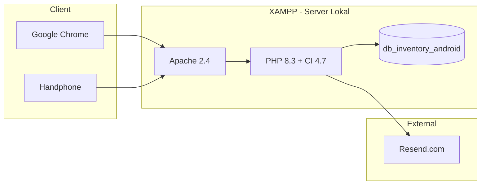
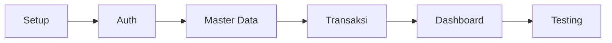

# Bab III–IV — Implementasi & Pengujian

[← Kembali ke README](README.md)

---

## 1. Stack Teknologi

> Proposal menyebut CodeIgniter secara umum. Implementasi menggunakan versi terbaru (Juni 2026).

| Komponen | Versi | Catatan |
|----------|-------|---------|
| **PHP** | 8.3+ | Minimum 8.2 (syarat CI4) |
| **CodeIgniter** | 4.7.3 | Framework MVC utama |
| **MySQL** | 8.4 LTS | `db_inventory_android` |
| **Composer** | 2.x | Dependency management |
| **Apache** | 2.4.x | Via XAMPP |
| **Dompdf** | Terbaru | PDF laporan & transaksi |
| **Resend** | — | Email reset password — **API key menyusul** |
| **Bootstrap** | 5.3 | UI framework |
| **Chart.js** | 4.x | Grafik dashboard |

### Ekstensi PHP Wajib

`intl`, `mbstring`, `mysqlnd`, `curl` (opsional)

### Arsitektur Sistem



### Pola Aplikasi (CI4)

| Aspek | Implementasi |
|-------|--------------|
| Pola | MVC — Model, View, Controller |
| Auth | Session + Filter (`AuthFilter`, `RoleFilter`) |
| Email | CI4 Email → Resend SMTP |
| PDF | Dompdf |
| Database | Migration + Model |
| CLI | `php spark` (migrate, serve, seed) |

### Email Resend — Template `.env`

```ini
database.default.database = db_inventory_android

email.fromEmail = noreply@TBD_DOMAIN
email.fromName  = Android Service Inventory
email.SMTPHost  = smtp.resend.com
email.SMTPUser  = resend
email.SMTPPass  = TBD_RESEND_API_KEY
email.SMTPPort  = 587
email.SMTPCrypto = tls

auth.resetTokenTTL = 3600
```

> Sampai Resend siap: uji lupa password via log email (`writable/logs`) atau Mailpit lokal.

---

## 2. Requirement Non-Fungsional

| Aspek | Requirement |
|-------|-------------|
| UI/UX | Antarmuka sederhana, responsif (uji di handphone) |
| Keamanan | Autentikasi, RBAC, password ter-hash, reset via email |
| Akurasi | Stok terupdate otomatis dari transaksi |
| Real-time | Monitoring stok & waktu di header |
| Pelaporan | Export PDF otomatis (Dompdf) |
| Arsitektur | MVC (CodeIgniter 4.7) |
| Pengujian | Black Box Testing |
| Pemeliharaan | Corrective, Adaptive, Perfective, Preventive |

### Keamanan

- Session-based authentication (CI4 Session)
- Password: `password_hash` PHP 8.3+
- Route terproteksi: `AuthFilter`, `RoleFilter`
- Reset password: token sekali pakai, TTL 60 menit
- Validasi server-side (CI4 Validation)
- CSRF protection pada form

### Performa

- Pagination pada tabel besar
- Index database pada kolom filter (lihat [05-desain-database.md](05-desain-database.md))
- Query efisien untuk dashboard

---

## 3. Black Box Testing

Metode: input → observasi output, tanpa inspeksi kode internal.

| No | Modul | Skenario | Input | Output Diharapkan |
|----|-------|----------|-------|-------------------|
| 1 | Login | Kredensial valid | username + password benar | Redirect ke dashboard |
| 2 | Login | Kredensial invalid | username/password salah | Pesan error |
| 3 | Sparepart | Tambah data | Form lengkap | Data tersimpan |
| 4 | Sparepart | Edit data | Ubah field | Data terupdate |
| 5 | Sparepart | Hapus data | Konfirmasi hapus | Data terhapus |
| 6 | Aksesoris | CRUD | Sama seperti sparepart | Sama |
| 7 | Barang Masuk | Transaksi baru | Faktur + item | Stok bertambah |
| 8 | Barang Keluar | Transaksi valid | Stok cukup | Stok berkurang |
| 9 | Barang Keluar | Stok tidak cukup | Qty > stok | Error, ditolak |
| 10 | Pencarian | Cari barang | Keyword | Hasil filter benar |
| 11 | Filter | Filter kategori/tanggal | Pilih filter | Data terfilter |
| 12 | Laporan | Generate PDF | Jenis + periode | PDF terdownload |
| 13 | Logout | Keluar sistem | Klik logout | Session hilang |
| 14 | RBAC | Karyawan akses /pengguna | Login karyawan | 403 / menu tersembunyi |
| 15 | RBAC | Karyawan hapus transaksi | Klik hapus | Tombol tidak ada |
| 16 | Stok | Threshold rendah | Stok = 2 | `status_stok = rendah` |
| 17 | Transaksi | Hapus masuk (admin) | Hapus faktur | Stok **tidak** berubah |
| 18 | Password | Lupa password | Email terdaftar | Email terkirim |
| 19 | Password | Token expired | Link > 60 menit | Pesan error |
| 20 | Password | Reset berhasil | Password baru | Login sukses |
| 21 | Master | Hapus barang berriwayat | Ada di detail transaksi | Error, tidak terhapus |
| 22 | Keluar | Edit transaksi (admin) | Ubah qty | Stok ter-recalculate |
| 23 | Keluar | Edit (karyawan) | Akses form edit | Ditolak |
| 24 | Laporan | On-the-fly | Filter periode | PDF sesuai DB saat ini |

---

## 4. Roadmap Implementasi

> Belum dikerjakan — urutan development.

| Fase | Task | Referensi |
|------|------|-----------|
| **1. Setup** | XAMPP, CI4.7, `.env`, migration, seed | §1, [05-desain-database.md](05-desain-database.md) |
| **2. Auth** | Login, logout, Filter, lupa password | [02-kebutuhan-sistem.md](02-kebutuhan-sistem.md) |
| **3. Master Data** | CRUD sparepart, aksesoris, supplier, pengguna | [02-kebutuhan-sistem.md §3](02-kebutuhan-sistem.md#3-modul-fitur) |
| **4. Transaksi** | Barang masuk/keluar, auto stok, penomoran | [02-kebutuhan-sistem.md §2](02-kebutuhan-sistem.md#2-aturan-bisnis) |
| **5. Dashboard & Laporan** | Chart.js, monitoring stok, Dompdf | [02-kebutuhan-sistem.md §3.2](02-kebutuhan-sistem.md#32-dashboard) |
| **6. Testing** | UI responsif, black box, evaluasi prototype | §3, [01-konteks-penelitian.md](01-konteks-penelitian.md) |


