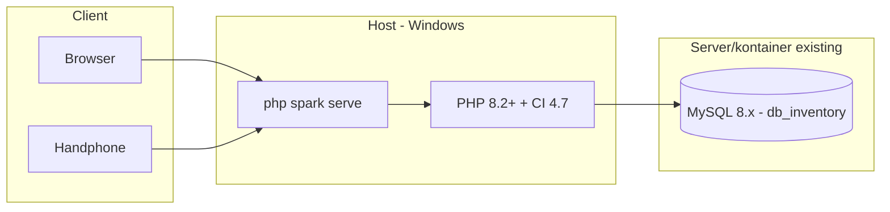
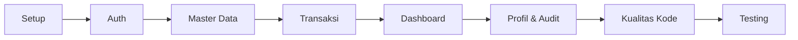

# Bab III–IV — Implementasi & Pengujian

[← Kembali ke README](README.md)

---

## 1. Stack Teknologi

> Proposal menyebut CodeIgniter secara umum. Implementasi menggunakan versi terbaru (2026).
> Lingkungan dev: aplikasi berjalan langsung di **host (Windows)**; MySQL memakai server/kontainer existing yang di-expose ke `localhost`.

| Komponen             | Versi        | Catatan                                             |
| -------------------- | ------------ | --------------------------------------------------- |
| **PHP**              | 8.2+         | Host (Windows); minimum 8.2 (syarat CI4)            |
| **CodeIgniter**      | 4.7          | Framework MVC utama                                 |
| **MySQL**            | 8.x          | Server/kontainer existing · `db_inventory`          |
| **Composer**         | 2.x          | Dependency management (host)                        |
| **Web server (dev)** | PHP built-in | `php spark serve` — pengganti Apache di development |
| **Dompdf**           | 3.x          | PDF laporan & transaksi                             |
| **Bootstrap**        | 5.3          | UI framework                                        |
| **Chart.js**         | 4.x          | Grafik dashboard                                    |
| **PHP-CS-Fixer**     | 3.x          | Code style (dev, dijalankan di CI)                  |
| **PHPStan**          | 2.x          | Static analysis (dev, dijalankan di CI)             |

### Ekstensi PHP Wajib

`intl`, `mbstring`, `mysqli` / `pdo_mysql`, `curl`, `gd`, `zip`, `fileinfo`

### Arsitektur Sistem (Development)


```mermaid
flowchart LR
    subgraph client [Client]
        Browser[Browser]
        Mobile[Handphone]
    end
    subgraph host [Host - Windows]
        Spark["php spark serve"]
        PHP[PHP 8.2+ + CI 4.7]
    end
    subgraph db [Server/kontainer existing]
        MySQL[("MySQL 8.x - db_inventory")]
    end
    Browser --> Spark
    Mobile --> Spark
    Spark --> PHP
    PHP --> MySQL
```

### Lingkungan & Perintah

```bash
# 1. Dependensi
composer install

# 2. Konfigurasi: salin env -> .env, sesuaikan koneksi database

# 3. Migrasi & seed
php spark migrate
php spark db:seed AdminSeeder

# 4. Jalankan
php spark serve --port 8080
# -> http://localhost:8080
```

DB client: CLI `mysql`, DBeaver, TablePlus, dll.

### Pola Aplikasi (CI4)

| Aspek       | Implementasi                                      |
| ----------- | ------------------------------------------------- |
| Pola        | MVC — Model, View, Controller                     |
| Auth        | Session + Filter (`AuthFilter`, `RoleFilter`)     |
| Audit       | `AuditService` → tabel `activity_logs`            |
| Email       | CI4 Email (opsional, untuk reset password)        |
| PDF         | Dompdf                                            |
| Database    | Migration + Model · host `127.0.0.1:3306`         |
| CLI         | `php spark` (migrate, serve, seed)                |
| Kualitas    | PHP-CS-Fixer + PHPStan (CI)                       |

### Database & Email — Template `.env`

Salin file `env` → `.env`, lalu sesuaikan koneksi. Gunakan `127.0.0.1` (bukan `localhost`) agar driver MySQLi memakai koneksi TCP. Kredensial nyata tidak di-commit.

```ini
app_baseURL = 'http://localhost:8080'

database.default.hostname = 127.0.0.1
database.default.database = db_inventory
database.default.username = <user>
database.default.password = <password>
database.default.DBDriver = MySQLi
database.default.port = 3306

# Password admin awal untuk AdminSeeder
admin.defaultPassword = '<password_admin>'

# Email (opsional) — untuk fitur reset password
# email.fromEmail  = noreply@contoh.com
# email.fromName   = Android Service Inventory
# email.SMTPHost   = <smtp_host>
# email.SMTPUser   = <smtp_user>
# email.SMTPPass   = <smtp_pass>
# email.SMTPPort   = 587
# email.SMTPCrypto = tls
```

---

## 2. Requirement Non-Fungsional

| Aspek        | Requirement                                           |
| ------------ | ----------------------------------------------------- |
| UI/UX        | Antarmuka sederhana, responsif (uji di handphone)     |
| Keamanan     | Autentikasi, RBAC, password ter-hash, reset via email |
| Akurasi      | Stok terupdate otomatis dari transaksi                |
| Real-time    | Monitoring stok & waktu di header                     |
| Pelaporan    | Export PDF otomatis (Dompdf)                          |
| Arsitektur   | MVC (CodeIgniter 4.7)                                 |
| Pengujian    | Black Box Testing                                     |
| Pemeliharaan | Corrective, Adaptive, Perfective, Preventive          |

### Keamanan

- Session-based authentication (CI4 Session)
- Password: `password_hash` (bcrypt) PHP 8.2+
- Route terproteksi: `AuthFilter`, `RoleFilter`
- Reset password: token sekali pakai, TTL 60 menit
- Audit trail: aktivitas pengguna dicatat ke `activity_logs`
- Unggah foto: validasi tipe (JPG/PNG/WebP) & ukuran (≤ 2 MB)
- Validasi server-side (CI4 Validation)
- CSRF protection pada form

### Performa

- Pagination pada tabel besar
- Index database pada kolom filter (lihat [05-desain-database.md](05-desain-database.md))
- Query efisien untuk dashboard

---

## 3. Black Box Testing

Metode: input → observasi output, tanpa inspeksi kode internal.

| No  | Modul         | Skenario                 | Input                          | Output Diharapkan                                                   |
| --- | ------------- | ------------------------ | ------------------------------ | ------------------------------------------------------------------- |
| 1   | Login         | Kredensial valid         | username + password benar      | Redirect ke dashboard                                               |
| 2   | Login         | Kredensial invalid       | username/password salah        | Pesan error                                                         |
| 3   | Sparepart     | Tambah data              | Form lengkap                   | Data tersimpan                                                      |
| 4   | Sparepart     | Edit data                | Ubah field                     | Data terupdate                                                      |
| 5   | Sparepart     | Hapus data               | Konfirmasi hapus               | Data terhapus                                                       |
| 6   | Aksesoris     | CRUD                     | Sama seperti sparepart         | Sama                                                                |
| 7   | Barang Masuk  | Transaksi baru           | Faktur + item                  | Stok bertambah                                                      |
| 8   | Barang Keluar | Transaksi valid          | Stok cukup                     | Stok berkurang                                                      |
| 9   | Barang Keluar | Stok tidak cukup         | Qty > stok                     | Error, ditolak                                                      |
| 10  | Pencarian     | Cari barang              | Keyword                        | Hasil filter benar                                                  |
| 11  | Filter        | Filter kategori/tanggal  | Pilih filter                   | Data terfilter                                                      |
| 12  | Laporan       | Generate PDF             | Jenis + periode                | PDF terdownload                                                     |
| 13  | Logout        | Keluar sistem            | Klik logout                    | Session hilang                                                      |
| 14  | RBAC          | Karyawan akses /pengguna | Login karyawan                 | 403 / menu tersembunyi                                              |
| 15  | RBAC          | Karyawan hapus transaksi | Klik hapus                     | Tombol tidak ada                                                    |
| 16  | Stok          | Threshold rendah         | Stok = 2                       | `status_stok = rendah`                                              |
| 17  | Transaksi     | Hapus masuk (admin)      | Hapus faktur, stok masih cukup | Stok **berkurang** (rollback masuk); gagal jika stok sudah terpakai |
| 17b | Transaksi     | Hapus keluar (admin)     | Hapus transaksi keluar         | Stok **bertambah** (rollback keluar)                                |
| 18  | Password      | Lupa password            | Email terdaftar                | Email terkirim                                                      |
| 19  | Password      | Token expired            | Link > 60 menit                | Pesan error                                                         |
| 20  | Password      | Reset berhasil           | Password baru                  | Login sukses                                                        |
| 21  | Master        | Hapus barang berriwayat  | Ada di detail transaksi        | Error, tidak terhapus                                               |
| 22  | Keluar        | Edit transaksi (admin)   | Ubah qty                       | Stok ter-recalculate                                                |
| 23  | Keluar        | Edit (karyawan)          | Akses form edit                | Ditolak                                                             |
| 24  | Laporan       | On-the-fly               | Filter periode                 | PDF sesuai DB saat ini                                              |
| 25  | Profil        | Ubah data diri           | Nama/email/telepon valid       | Data tersimpan, nama di topbar berubah                              |
| 26  | Profil        | Email sudah dipakai      | Email milik user lain          | Error validasi, ditolak                                             |
| 27  | Profil        | Ganti password           | Password lama benar + baru     | Password terganti, bisa login dgn password baru                    |
| 28  | Profil        | Ganti password salah     | Password lama salah            | Error "Password lama tidak sesuai"                                  |
| 29  | Profil        | Unggah foto              | JPG/PNG/WebP ≤ 2 MB            | Foto tersimpan & tampil sebagai avatar                              |
| 30  | Profil        | Unggah foto invalid      | Bukan gambar / > 2 MB          | Error validasi, ditolak                                             |
| 31  | Profil        | Hapus foto               | Klik hapus foto                | Foto terhapus, avatar kembali ke inisial                           |
| 32  | Audit trail   | Aksi tercatat            | Login/CRUD/logout              | Baris tercatat di `activity_logs`                                   |

---

## 4. Roadmap Implementasi

> Implementasi inti sudah ada di codebase (CI4). Uji black box manual menyusul.

| Fase                       | Task                                            | Status           |
| -------------------------- | ----------------------------------------------- | ---------------- |
| **1. Setup**               | Koneksi MySQL, CI4.7, `.env`, migration, seed   | Done             |
| **2. Auth**                | Login, logout, Filter, lupa password            | Done             |
| **3. Master Data**         | CRUD sparepart, aksesori, supplier, pengguna    | Done             |
| **4. Transaksi**           | Barang masuk/keluar, auto stok, penomoran, PDF  | Done             |
| **5. Dashboard & Laporan** | Chart.js (6 KPI), monitoring stok, Dompdf       | Done             |
| **6. Profil & Audit**      | Profil + foto, ganti password, `activity_logs`  | Done             |
| **7. Kualitas Kode**       | PHP-CS-Fixer + PHPStan di CI                    | Done             |
| **8. Testing**             | UI responsif, black box lengkap                 | Manual / ongoing |


```mermaid
flowchart LR
    F1[Setup] --> F2[Auth]
    F2 --> F3[Master Data]
    F3 --> F4[Transaksi]
    F4 --> F5[Dashboard]
    F5 --> F6[Profil & Audit]
    F6 --> F7[Kualitas Kode]
    F7 --> F8[Testing]
```
